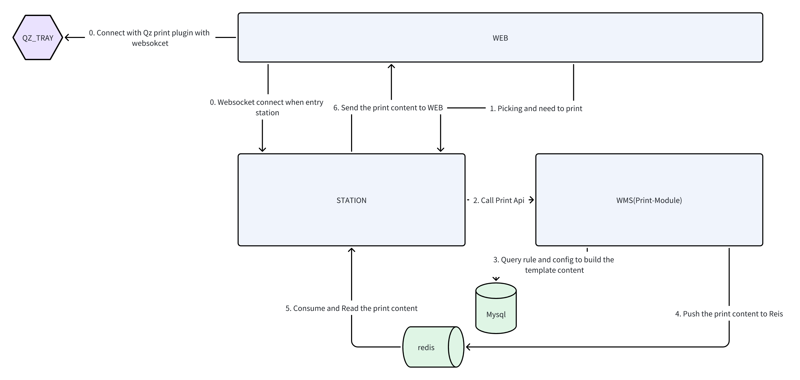
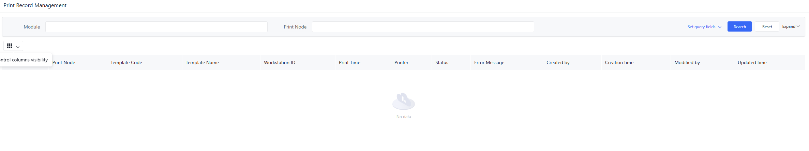
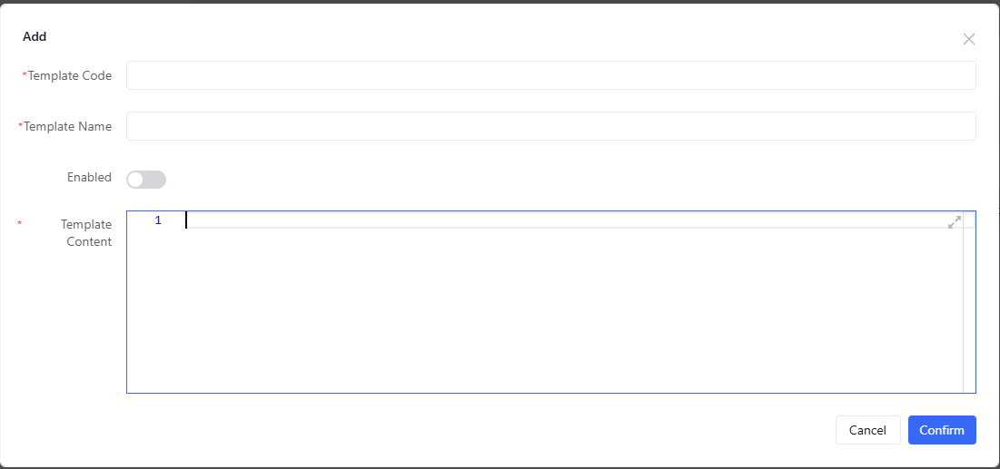
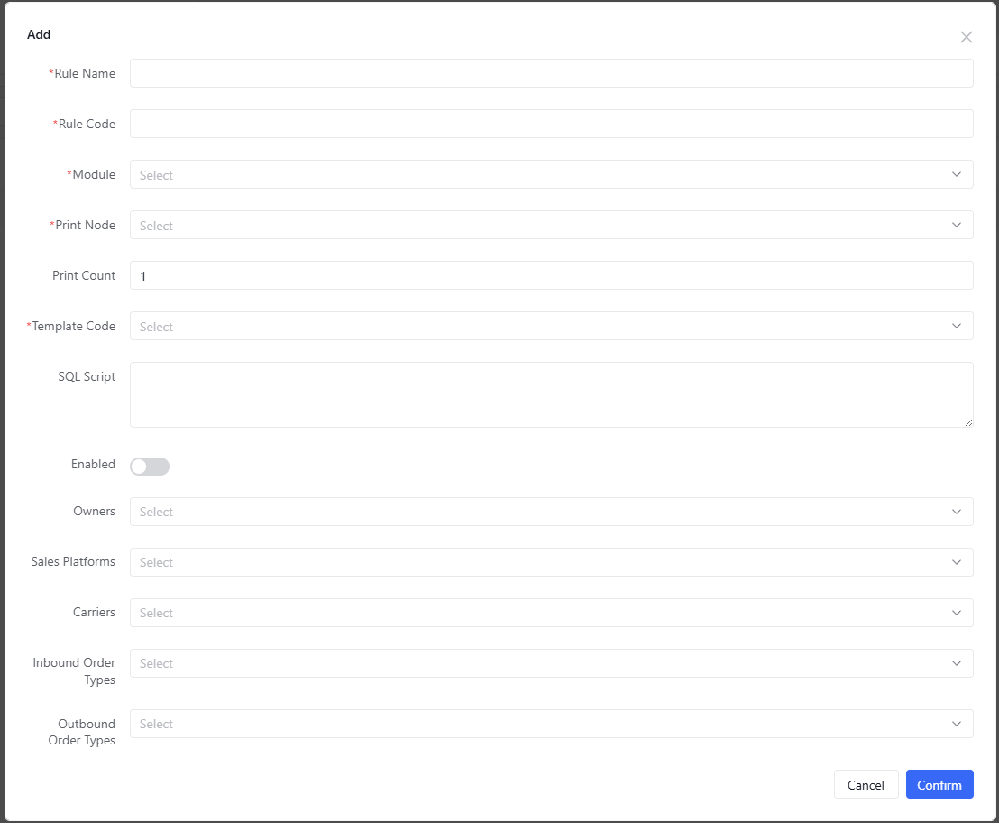
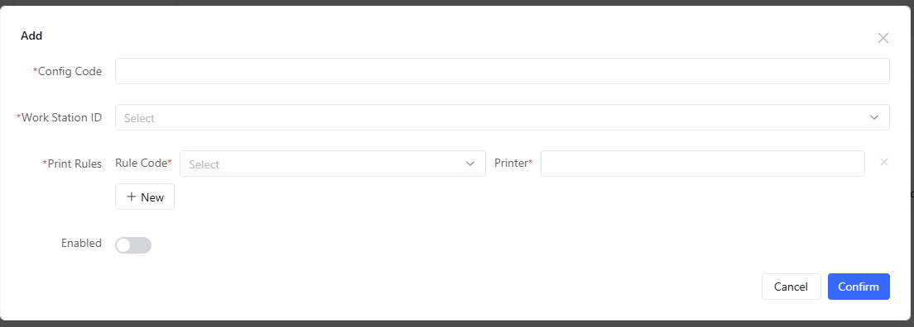

## 0. Printing Module Design

### Websocket Connection
When users access the STATION site, the system establishes real-time connections via WebSocket:
- Connection with the WEB service (Label 0)
- WEB browser also connects with the QZ_TRAY printing plugin (Label O)

### Triggering Print Requests
1. Users trigger printing needs after completing picking operations at STATION (Label 1)
2. The system then calls the printing API (Label 2)

### Template Construction & Data Processing
1. Upon receiving requests, the WMS printing module:
2. Queries printing rules and configurations from MySQL database (Label 3)
3. Dynamically generates printing template content based on rules
4. Pushes content to Redis queue (Label 4)

### Content Consumption & Transmission
1. STATION consumes and reads printing content from Redis (Label 5)
2. Sends content to WEB service (Label 6)

### Printing Execution
WEB connects with the QZ_TRAY printing plugin via WebSocket, ultimately driving the printer output (Label O).

### Process Characteristics
1. Relies on MySQL for configuration storage and Redis for efficient content relay
2. Maintains real-time communication via WebSocket to ensure immediate printing commands
3. Clear module division (WMS handles logic processing, WEB handles communication relay)

> QZ_Tray is a printing plugin for implementing printing functionality on Windows systems. https://qz.io/

## 1. System Login & Navigation

### 1.1 System Login
- Open browser and enter system URL
- Input username and password on login page
- Click "Login" button to enter system

### 1.2 Navigate to Printing Management
- After successful login, find "Configuration Center" > "Print Configuration" in left navigation bar
- Click to expand and select "Print Records"
- System will display the main printing task management page
  

## 2. Printing Configuration Process

### 2.1 Configuring Print Templates

#### Create New Template
1. Go to "Print Configuration" > "Print Templates"
2. Click "Add" button
3. Fill template information:
   - **Template Code**: Unique identifier (e.g. "X3M")
   - **Template Name**: Descriptive name (e.g. "Packaging Info Template")
   - **Template Content**: HTML content
   - **Active Status**: Check to enable
4. Click "Save" to complete
   

### 2.2 Configuring Print Rules

#### Create New Rule
1. Go to "Print Configuration" > "Print Rules"
2. Click "Add" button
3. Fill rule information:

   **Basic Info**
   - Rule Name: Descriptive name
   - Rule Code: Unique identifier
   - Module: Select business module
   - Print Node: Select trigger timing

   **Condition Settings**
   - Owner Code (optional)
   - Sales Platform (optional)
   - Carrier Code (optional)
   - Order Type (optional)

   **Print Settings**
   - Template Code: Select related template
   - SQL Script: For querying print data (optional)
   - Print Copies: Default quantity

4. Click "Save" to complete
   

### 2.3 Configuring Workstation Print Settings

#### Create New Configuration
1. Go to "Print Configuration" > "Print Settings"
2. Click "Add" button
3. Fill configuration:
   - Config Code: Unique identifier
   - Workstation ID: Target workstation
   - Print Config Details:
      - Add rules
      - Specify printer
4. Click "Save" to complete
   

## 3. Print Record Query

### 3.1 Basic Query
1. Go to "Print Record Management"
2. Set query conditions:
   - Module (required)
   - Print Node (required)
   - Workstation ID (optional)
   - Time Range (optional)
   - Status (optional)
3. Click "Search" to execute

### 3.2 Record Processing
- **Successful Records**: Display print details
- **Failed Records**:
   - View error messages
   - Click "Retry" button
   - Export error reports

## 4. FAQ

### Q1: Rules not working?
1. Check rule status
2. Verify related template status
3. Confirm workstation configuration
4. Check business data matching

### Q2: Garbled printing?
1. Check template encoding
2. Verify printer driver
3. Confirm font support

## 5. Notes
⚠️ **Important**
- Disable configurations before deletion
- Regularly check print records
- Permission control set by admin
