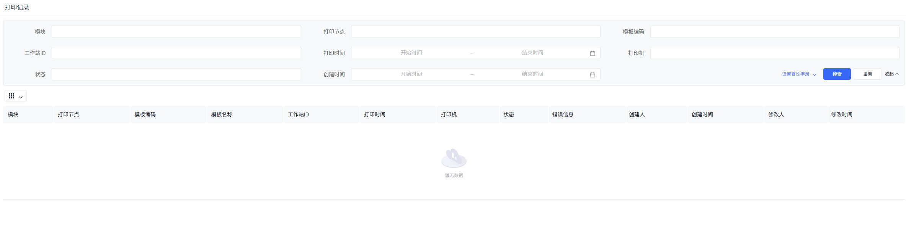
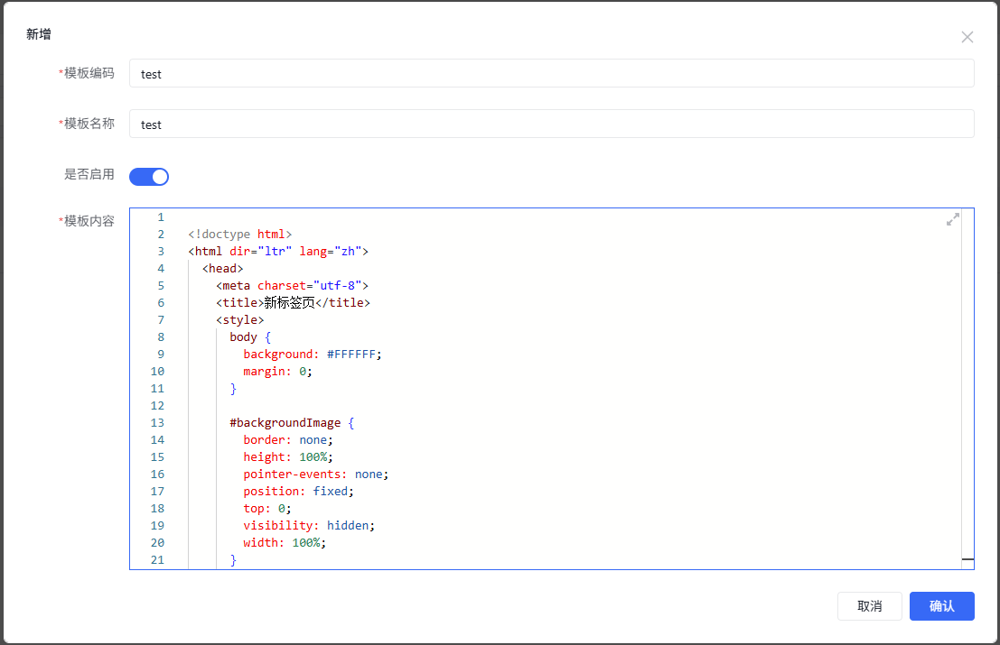
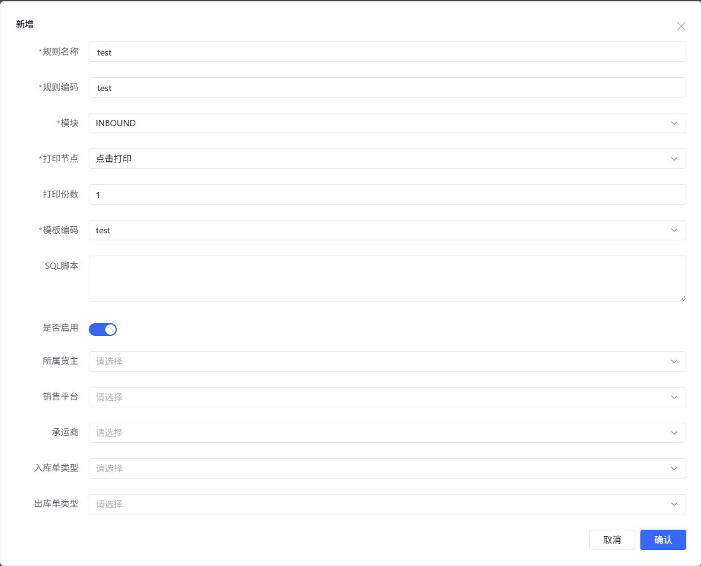
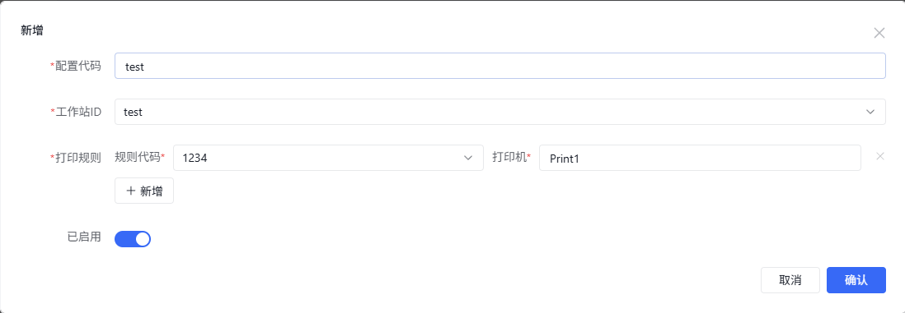

## 0. 打印模块设计

### Websocket 连接
当用户进入STATION站点时，系统通过WebSocket与WEB服务建立实时连接（标注0）
,同时WEB浏览器会与QZ_TRAY打印插件建立实时连接（标注O）。

### 触发打印请求
用户在STATION完成拣货操作后触发打印需求（标注1），随后调用打印API（标注2）。

### 模板构建与数据处理
1. WMS打印模块接收到请求后：
2. 从MySQL数据库查询打印规则和配置（标注3）；
3. 根据规则动态生成打印模板内容；
4. 将内容推送至Redis 队列（标注4）。
 
### 内容消费与传输
STATION从Redis消费并读取打印内容（标注5），随后将内容发送给WEB服务（标注6）。

### 执行打印###
WEB通过WebSocket与QZ_TRAY打印插件连接，最终驱动打印机输出（标注O）。

### 流程特点###
1. 依赖MySQL存储配置、Redis实现高效内容中转；
2. 全程通过WebSocket保持实时通信，确保打印指令的即时性；
3. 各模块分工明确（如WMS负责逻辑处理，WEB负责通信中转）。

> QZ_Tray 是一个打印插件，用于在Windows系统上实现打印功能。https://qz.io/

## 1. 系统登录与导航

### 1.1 登录系统
- 打开浏览器，输入系统网址
- 在登录页面输入您的用户名和密码
- 点击"登录"按钮进入系统

### 1.2 导航到打印管理页面
- 登录成功后，在左侧导航栏中找到"配置中心" > "打印配置"
- 点击展开后选择"打印记录"
- 系统将显示打印任务管理主页面

## 2. 打印配置流程

### 2.1 配置打印模板

#### 创建新模板
1. 进入"打印配置 " > "打印模板"
2. 点击"新增"按钮
3. 填写模板信息：
    - **模板编码**：输入唯一标识符(如"X3M")
    - **模板名称**：描述性名称(如"包装信息模板")
    - **模板内容**：输入模板的html内容
    - **启用状态**：勾选以启用模板
4. 点击"保存"完成创建
   

### 2.2 配置打印规则

#### 创建新规则
1. 进入"打印配置 " > "打印规则"
2. 点击"新增"按钮
3. 填写规则信息：

   **基本信息**
    - 规则名称：描述性名称
    - 规则编码：唯一标识符
    - 模块：选择业务模块
    - 打印节点：选择触发时机

   **条件设置**
    - 货主编码（可选）
    - 销售平台（可选）
    - 承运商编码（可选）
    - 订单类型（可选）

   **打印设置**
    - 模板编码：选择关联模板
    - SQL脚本：用于查询打印数据（可选）
    - 打印份数：默认数量

4. 点击"保存"完成创建
   

### 2.3 配置工作站打印设置

#### 创建新配置
1. 进入"打印配置 " > "打印配置"
2. 点击"新增"按钮
3. 填写配置信息：
    - 配置编码：唯一标识符
    - 工作站ID：目标工作站
    - 打印配置详情：
        - 添加规则
        - 指定打印机
4. 点击"保存"完成创建
   

## 3. 打印记录查询

### 3.1 基本查询
1. 进入"打印记录管理"
2. 设置查询条件：
    - 模块（必选）
    - 打印节点（必选）
    - 工作站ID（可选）
    - 时间范围（可选）
    - 状态（可选）
3. 点击"搜索"执行查询

### 3.2 记录处理
- **成功记录**：显示打印详情
- **失败记录**：
    - 查看错误信息
    - 可点击"重试"按钮
    - 支持导出错误报告

## 4. 常见问题解答

### Q1: 规则未生效怎么办？
1. 检查规则状态
2. 验证关联模板状态
3. 确认工作站配置
4. 检查业务数据匹配

### Q2: 打印乱码处理
1. 检查模板编码
2. 验证打印机驱动
3. 确认字体支持

## 5. 注意事项
⚠️ **重要提示**
- 删除配置前请先禁用
- 建议定期检查打印记录
- 权限控制由管理员设置
